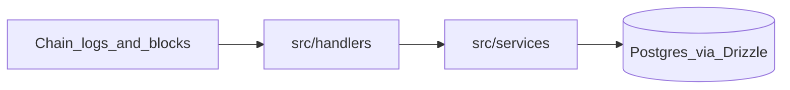

# cfg-api-v3 — AI & contributor guide

This document describes how this codebase is structured and the rules we follow when changing it. For setup, environment variables, Docker, and operational scripts, see [README.md](README.md). **Cursor** loads extra, scoped rules from [`.cursor/rules/*.mdc`](.cursor/rules/) (see `cfg-api-v3-core.mdc` for the always-on summary).

## What this project is

[cfg-api-v3](https://github.com/centrifuge/api-v3) is a blockchain indexer for the Centrifuge protocol, built with [Ponder](https://ponder.sh/). It ingests EVM logs (and block events where configured), persists structured rows in PostgreSQL, and exposes a GraphQL API while the process runs.

## Architecture (high level)



Handlers react to the chain; services own persistence and reusable domain logic.

## Hard rules

1. **Handlers live only under [`src/handlers/`](src/handlers/)**  
   They subscribe via `multiMapper(...)` or `ponder.on(...)`. Keep them thin: decode `event.args`, load context, orchestrate calls—no heavy business logic that belongs in a service.

2. **Handlers must not touch the database directly**  
   Do not call `context.db.*`, Drizzle query builders, or raw SQL from handlers. Route all reads and writes through [`src/services/`](src/services/) (see below).  
   **Approved exception:** [`src/helpers/snapshotter.ts`](src/helpers/snapshotter.ts) performs `context.db.sql.insert` into snapshot tables; handlers call `snapshotter(...)` rather than duplicating that logic.

3. **Do not use Ponder’s ad-hoc handler DB patterns**  
   We centralize persistence in entity services built on [`src/services/Service.ts`](src/services/Service.ts). Handlers should not mirror examples that inline `context.db` in the handler body.

4. **Optimize database work per handler**  
   Prefer batch APIs and fewer round-trips: use `insertMany` / `saveMany` from services when semantics match. Query once, then update in memory and batch-save where possible.

5. **Never change or touch files under [`generated/`](generated/)**  
   That directory is produced by tooling (`pnpm update-registry`, `ponder codegen`, and similar build/start steps). Do not edit or patch files there by hand—regenerate via the scripts or fix the upstream registry / source that feeds codegen.

## Services and the base `Service`

- **One dedicated service per main schema entity** (or a tightly related group), e.g. [`AdapterService.ts`](src/services/AdapterService.ts):

  ```ts
  export class AdapterService extends mixinCommonStatics(
    Service<typeof Adapter>,
    Adapter,
    "Adapter"
  ) {}
  ```

- **Extend** `Service<typeof Table>` and **`mixinCommonStatics(Service, table, name)`** so you get shared static helpers: `insert`, `insertMany`, `saveMany`, `get`, `getOrInit`, `upsert`, `query`, `count`, plus instance `save` / `delete`.

- **Add public methods** (static or instance) on that service for business rules reused across handlers.

- **Logging in services:** use **`serviceLog`** and **`serviceError`** from [`src/helpers/logger.ts`](src/helpers/logger.ts) (same pattern as [`src/services/Service.ts`](src/services/Service.ts)). Use **`serviceLog`** for progress and context (what the method is doing, identifiers, counts). Use **`serviceError`** when reporting failures or unexpected states that operators must notice. **Each public or static method** on a service class that performs **meaningful work** (database access, external effects, or non-trivial branching)—including custom methods you add on entity services—should include **at least one** log line so indexer runs remain observable—typically `serviceLog` at entry or after the main outcome, and `serviceError` on error branches. **Trivial pure accessors** (e.g. `read()` that only returns a shallow copy of loaded state) do not need logging. Pair with **`expandInlineObject`** from the same module when logging record-shaped data, matching existing calls in the base `Service` mixins. Implementation note: **`serviceLog` is a no-op when the process is started with `ponder start`**; **`serviceError`** still writes to stderr in that mode—see `logger.ts` if you rely on logs in production-style runs.

- **Implementation detail (not for handlers):** the base layer uses **`context.db.sql`** (Drizzle) for most reads/writes. `getOrInit` also uses **`context.db.find`** on the lookup path. Handlers never call these; they call `FooService.get(...)`, etc.

- **`saveMany` and `excluded` columns:** when extending batch upserts, follow the comment in `Service.ts`: do not use patterns that expand to invalid `excluded` references for Ponder’s PostgreSQL proxy—use `sql.raw(\`excluded."column"\`)` with the real column name when needed.

## Batch inserts

- Prefer **`EntityService.insertMany(context, rows, event)`** for many independent inserts with `onConflictDoNothing`-style semantics.
- Prefer **`EntityService.saveMany(context, instances, event)`** when you need the same upsert semantics as instance `save` (multi-row `INSERT … ON CONFLICT DO UPDATE`).

Examples: [`src/handlers/gatewayHandlers.ts`](src/handlers/gatewayHandlers.ts), [`src/services/CrosschainMessageService.ts`](src/services/CrosschainMessageService.ts).

## `multiMapper` — multiple protocol versions

Contract keys in [`ponder.config.ts`](ponder.config.ts) are versioned (`HubV3`, `HubV3_1`, …). [`src/helpers/multiMapper.ts`](src/helpers/multiMapper.ts) lets you register **once** with an **unversioned** event string:

- `multiMapper("Hub:NotifyPool", handler)` registers the handler for every deployed version (`HubV3:NotifyPool`, `HubV3_1:NotifyPool`, …) where the ABI exposes that event.
- **`:setup`** (e.g. `multiAdapter:setup`) is a Ponder lifecycle hook, not an ABI event: it is registered for each matching versioned contract without ABI filtering.
- For overloaded / parameterized event names, follow the string rules already implemented in `multiMapper` (parentheses in the event string vs plain name).

## Registries, chains, and contract config

- **`generated/`** — registry data, types, and other codegen output from `pnpm update-registry` / `ponder codegen` (see README). **Do not modify**; it is regenerated at build or indexer startup, not maintained by hand.
- **[`src/chains.ts`](src/chains.ts)** — chain configs, RPC endpoints, `blocks` for block handlers, deduplicated registry chains.
- **[`src/contracts.ts`](src/contracts.ts)** — `decorateDeploymentContracts` merges registry ABIs/addresses into Ponder contract config.
- **[`ponder.config.ts`](ponder.config.ts)** — `contractsV3` and `contractsV3_1` merged into `contracts`; `ordering: "omnichain"`. Optional migration start blocks: [`src/config.ts`](src/config.ts) (`V3_1_MIGRATION_BLOCKS`).

## Snapshots and historical data

We use a **snapshot pattern** for point-in-time copies of entity state:

- **[`src/helpers/snapshotter.ts`](src/helpers/snapshotter.ts)** — takes service instances, reads current row data, attaches timestamp, block, trigger label, tx hash, chain id, and inserts into the given snapshot table (`onConflictDoNothing`).
- **Period-based triggers:** [`src/helpers/timekeeper.ts`](src/helpers/timekeeper.ts) tracks 24-hour period boundaries per chain. [`src/handlers/blockHandlers.ts`](src/handlers/blockHandlers.ts) listens to `${chainName}:block`; when a **new period** starts it runs `snapshotter` with trigger `${chainName}:NewPeriod` for active pools, tokens, token instances, and relevant holding escrows.
- **Event-based triggers:** other handlers call `snapshotter(context, event, "<ContractVersion>:EventName", entities, SnapshotTable)` after updating live rows (e.g. holdings, share class manager, batch request manager, balance sheet, spoke—search for `snapshotter(` under `src/handlers/`).

## TypeScript and clean code

- **[`tsconfig.json`](tsconfig.json)** — `strict`, `noUncheckedIndexedAccess`; treat possibly undefined indexed access explicitly.
- Prefer types from **`ponder:registry`** and **`ponder:schema`**; avoid `any`.
- Use narrow types, early returns, and small functions. Keep side effects in services; handlers stay declarative orchestration.
- Match existing naming, imports, and JSDoc level when extending the codebase.

## Agent workflow (quick wins)

These habits reduce broken PRs and wasted review cycles when assistants (or humans) change the indexer:

1. **Verify before you stop** — After non-trivial edits, run **`pnpm typecheck`** and **`pnpm lint`** from the repo root. Fix all reported issues unless the task explicitly excludes them.

2. **Schema and codegen** — If you change [`ponder.schema.ts`](ponder.schema.ts) or Ponder-facing config, run **`pnpm codegen`** so `ponder:schema` / GraphQL artifacts stay aligned (see Ponder docs for when codegen is required).

3. **Copy a proven pattern** — Before adding a new handler or service method, open the **closest existing** file (same contract family or same table shape) and mirror structure: `multiMapper` strings, service calls, batch vs single-row saves, snapshot usage.

4. **Wire new services** — New entity services should be **exported** from [`src/services/index.ts`](src/services/index.ts) when other modules need them (match existing export style).

5. **Keep diffs focused** — One logical change per task; avoid drive-by formatting or unrelated refactors (easier for agents to review and revert).

6. **Discover events and names** — Ripgrep across [`src/handlers/`](src/handlers/) and [`generated/`](generated/) for existing `multiMapper("Contract:Event"` strings and ABI names. For **log files** from a running indexer, [`scripts/evgrep.sh`](scripts/evgrep.sh) filters whole “Received event …” blocks (see script usage).

7. **Document assumptions in the PR/commit** — If behavior depends on registry version, chain id, or migration blocks, say so in the description so the next agent does not “fix” working code.

## Helpers vs services

[`src/helpers/`](src/helpers/) holds cross-cutting utilities: **`serviceLog` / `serviceError`** and related helpers in [`logger.ts`](src/helpers/logger.ts), formatting, `multiMapper`, `timekeeper`, `snapshotter`, IPFS helpers, etc. They complement services but **do not replace** per-entity services for normal CRUD and domain rules. For high-level “we received this chain event” lines in handlers, **`logEvent`** from the same logger module is available where appropriate.

## Key files (quick index)

| Area | File |
|------|------|
| Cursor / Agent rules | [`.cursor/rules/`](.cursor/rules/) (`*.mdc`) |
| Generated (do not edit) | [`generated/`](generated/) |
| Ponder app config | [`ponder.config.ts`](ponder.config.ts) |
| Schema | [`ponder.schema.ts`](ponder.schema.ts) |
| Base service / batch APIs | [`src/services/Service.ts`](src/services/Service.ts) |
| Service barrel | [`src/services/index.ts`](src/services/index.ts) |
| Service / progress logging | [`src/helpers/logger.ts`](src/helpers/logger.ts) (`serviceLog`, `serviceError`, `expandInlineObject`, `logEvent`) |
| Multi-version event wiring | [`src/helpers/multiMapper.ts`](src/helpers/multiMapper.ts) |
| Snapshots | [`src/helpers/snapshotter.ts`](src/helpers/snapshotter.ts) |
| Period + block-driven snapshots | [`src/handlers/blockHandlers.ts`](src/handlers/blockHandlers.ts), [`src/helpers/timekeeper.ts`](src/helpers/timekeeper.ts) |
| Chains / blocks | [`src/chains.ts`](src/chains.ts) |
| Contract decoration | [`src/contracts.ts`](src/contracts.ts) |

For the short “handlers vs services” summary aimed at humans, see the **Handlers vs services** section in [README.md](README.md).
