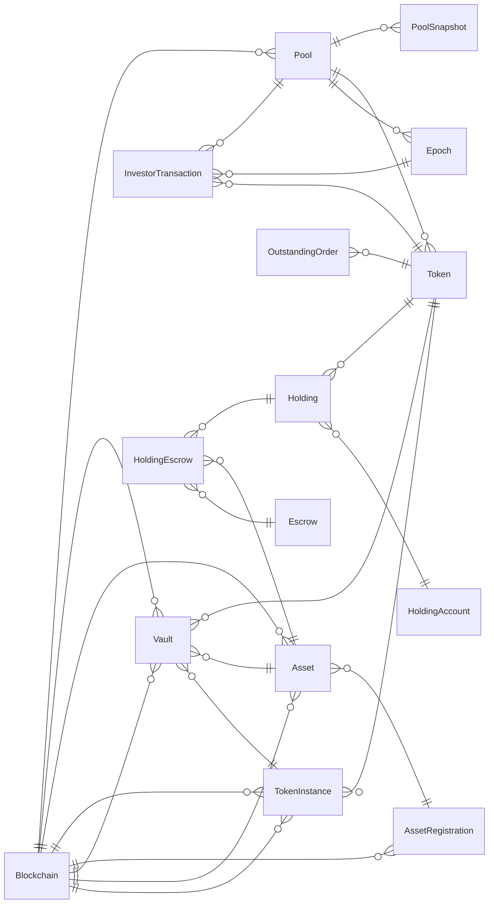

# 🌀 Centrifuge API V3

[](https://github.com/centrifuge/api-v3/actions/workflows/docker-build.yml)
[](https://centrifuge.io/)
[](https://embrio.tech)

A blockchain event indexer for the Centrifuge protocol, built with [Ponder](https://ponder.sh/).

---

## Overview

This project indexes EVM events from smart contracts in the Centrifuge protocol, maintaining a structured database of pools, share classes, and investment transactions.

## Key Components

### Event Handlers

- **Vault Handlers**: Process deposit/withdrawal requests and executions
- **MultiShareClass Handlers**: Manage share class lifecycle, epoch transitions, and investor orders
- **PoolRegistry Handlers**: Track pool creation and configuration
- **PoolManager Handlers**: Handle vault deployment for share classes

### Services

The project uses several services to maintain data consistency:

- `PoolService`: Manages investment pools
- `ShareClassService`: Handles share class configuration and metadata
- `EpochService`: Tracks investment epochs
- `InvestorTransactionService`: Processes user deposits and redemptions
- `OutstandingOrderService`: Tracks pending investment orders

## Getting Started

### Prerequisites

- Node.js (v22+)
- Ethereum RPC endpoint

### Installation

```bash
# Install dependencies
pnpm install --frozen-lockfile

# Create .env file with your configuration
cp .env.example .env.local
# Edit .env with your settings (RPC endpoint and API key)

# Fetch the registry data at build time
pnpm run update-registry

# Generate Ponder schema
pnpm run codegen
```

### Configuration

The indexer uses a compile-time registry system that loads chain and ABI configurations:

- **REGISTRY_HASH** (optional): Set this environment variable before running `pnpm run update-registry` to specify the IPFS hash of the registry JSON file. If not set, defaults to `https://registry.centrifuge.io/`
- **ENVIRONMENT**: Set to `mainnet` or `testnet` to select which chains to index (defaults to `mainnet`)

### Updating Registry Data

The registry data (chains and ABIs) is fetched at build time, not at runtime. This ensures:
- Full TypeScript typing support
- No runtime network dependencies
- Indexer can start reliably even with network issues

To update the registry data:

```bash
# Fetch latest registry from default URL
pnpm run update-registry

# Or fetch from a specific IPFS hash
REGISTRY_HASH=<ipfs-hash> pnpm run update-registry
```

This generates `src/registry.generated.ts` which contains all chain configurations and ABIs with full type safety.


### Running the Indexer

```bash
# Start the development server
pnpm dev

# Build for production
pnpm build

# Start production server
pnpm start
```

## Database Schema

The indexer builds and maintains a structured database with the following primary entities:

- Pools
- ShareClasses
- Epochs
- InvestorTransactions
- OutstandingOrders

## API

Once running, the Ponder indexer provides a GraphQL API for querying indexed data. URL printed on start.

## Entity Relationships

## Contributing

Contributions are welcome! Please feel free to submit a Pull Request.

## License

[MIT](/LICENSE) License
