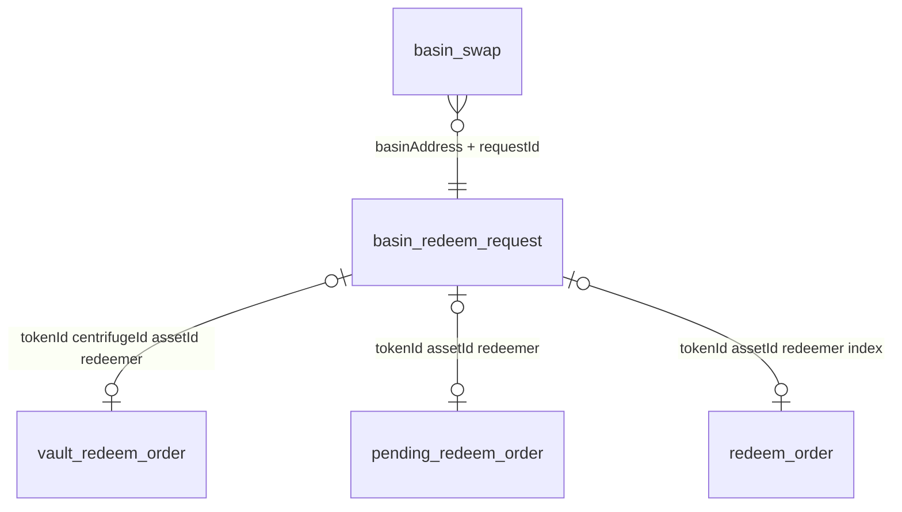
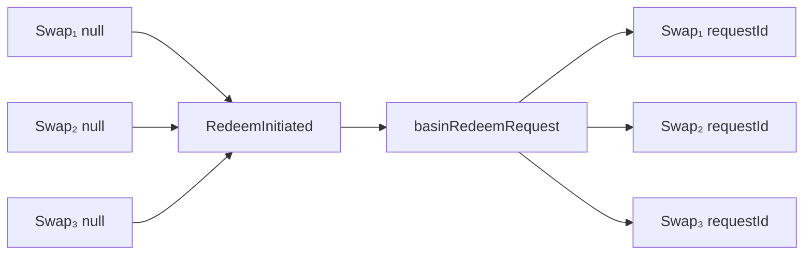

# Basin indexer — operational rollout spec

**Goal:** Ops can reconcile each **instant JTRSY → USDC** swap with the **fund redeem** (`tokenRedeemer` → spoke `vault:RedeemRequest` → hub `redeemOrder`), through settlement.

**Principles**

- **Basin on-chain:** `groveBasin` only (`swap`, `redeemInitiated`, `redeemCompleted`).
- **Centrifuge fund flow:** **spoke first, then hub** — pending redeem is visible from **`vault:RedeemRequest`**; approval and NAV live on **hub** `approveRedeems` / `revokeShares` / `claimRedeem` (existing handlers).
- **Reconciliation proceeds;** anomalies → `basinReconciliationWarning`, indexer **continues**.
- **GraphQL:** auto-generated via Ponder `relations()`; **out of scope** = ops dashboard UI and custom resolvers.

**Out of scope (later):** `basinPoolState` snapshots, config/LP/fee events, investor-history API, Chronicle, `latestAvailableNavAtSwap` rate-provider `eth_call`, ops dashboard UI.

**References:** [GroveBasin.sol](https://github.com/centrifuge/protocol/blob/main/GroveBasin.sol), protocol note [basin.md](../../cfg-protocol-v3/issues/basin.md).

| Item | Value |
|------|--------|
| Chain | Ethereum mainnet |
| GroveBasin | `0x1FA4dB8D545Cbd22b7bbA2084348A2E6ef36E363` |
| Start block | TBD (contracts team) |

**Static config** (`generated/basin.json` or env):

```json
{
  "basinAddress": "0x1FA4dB8D545Cbd22b7bbA2084348A2E6ef36E363",
  "chainId": 1,
  "centrifugeId": "<spoke chain id string>",
  "poolId": "<uint>",
  "tokenId": "<JTRSY share class hex>",
  "assetId": "<USDC AssetId on hub>",
  "creditToken": "<JTRSY ERC20>",
  "collateralToken": "<USDC>",
  "tokenRedeemer": "<TokenRedeemer contract>"
}
```

---

## 1. Data model

Ponder tables use `snake_case`; services use `camelCase` (`BasinSwapService`, etc.).

**Convention:** use **`primaryKey({ columns: [...] })` composite keys** — same as `redeemOrder`, `vaultRedeemOrder`, `pendingRedeemOrder`, `investorTransaction`. No synthetic string `id` column unless it duplicates a composite (prefer explicit columns in the PK).

### 1.0 Existing Centrifuge PKs (join targets)

| Table | Composite PK |
|-------|----------------|
| `vault_redeem_order` | `(tokenId, centrifugeId, assetId, accountAddress)` |
| `pending_redeem_order` | `(tokenId, assetId, account)` |
| `redeem_order` | `(tokenId, assetId, account, index)` |
| `epoch_redeem_order` | `(tokenId, assetId, index)` |

`basinRedeemRequest` stores the **same column names** as these PKs where they overlap (`tokenId`, `assetId`, `redeemer` = `account` / `accountAddress`, `linkedRedeemOrderIndex` = `index`, `centrifugeId` for spoke).

### 1.1 Tables (new)

#### `basin_config`

Seeded from static config (not from chain events).

| Column | Notes |
|--------|--------|
| `chainId`, `address` | **PK** `(chainId, address)` |
| `centrifugeId`, `poolId`, `tokenId`, `assetId` | |
| `creditToken`, `collateralToken`, `tokenRedeemer` | |

```ts
primaryKey({ columns: [t.chainId, t.address] })
```

#### `basin_swap`

One row per `Swap`.

| Column | Notes |
|--------|--------|
| `chainId`, `txHash`, `logIndex` | **PK** (event identity) |
| `basinAddress`, `poolId`, `tokenId` | |
| `direction` | `CREDIT_TO_COLLATERAL` \| … |
| `assetIn`, `assetOut`, `amountIn`, `amountOut` | |
| `sender`, `receiver` | |
| `basinAddress`, `basinRedeemRequestId` | nullable FK → `basin_redeem_request` **PK** — set on **`RedeemInitiated`** only (§1.4) |
| `priorityFeeDeltaBps` | nullable |
| `blockNumber`, `timestamp` | |

```ts
primaryKey({ columns: [t.chainId, t.txHash, t.logIndex] })
```

#### `basin_redeem_request`

One row per `RedeemInitiated`.

| Column | Notes |
|--------|--------|
| `basinAddress`, `requestId` | **PK** — `requestId` = `keccak256(abi.encode(RedeemRequest))` on contract |
| `centrifugeId`, `poolId`, `tokenId`, `assetId`, `redeemer` | join keys to spoke/hub tables |
| `creditTokenAmount`, `collateralTokenAmountQuoted` | |
| `state` | `INITIATED` \| `COMPLETED` |
| `initiatedBlock`, `initiatedTxHash`, `initiatedAt` | |
| `completedBlock`, `completedTxHash`, `completedAt` | nullable |
| `spokeRedeemRequestedAt`, `spokeRedeemRequestedTxHash` | nullable — point 2 |
| `collateralTokenReturned` | nullable |
| `linkedRedeemOrderIndex` | nullable — point 3; with PK cols above → `redeem_order` |

```ts
primaryKey({ columns: [t.basinAddress, t.requestId] })
```

#### `basin_reconciliation_warning`

Append-only; never fail indexing.

| Column | Notes |
|--------|--------|
| `chainId`, `txHash`, `logIndex` | **PK** |
| `type`, `message` | |
| `basinAddress`, `basinRedeemRequestId` | nullable context |
| `blockNumber`, `timestamp` | |

```ts
primaryKey({ columns: [t.chainId, t.txHash, t.logIndex] })
```

| `type` | When |
|--------|------|
| `batchSumMismatch` | `SUM(basinSwap.amountIn) ≠ creditTokenAmount` on initiate |
| `initiateNoSwaps` | no unbatched swaps to attach |
| `completeOrphan` | `redeemCompleted` with no matching batch |
| `redeemOrderLinkAmbiguous` | ≠1 open `basinRedeemRequest` at `approveRedeems` |
| `spokeRedeemLinkAmbiguous` | ≠1 open batch at `vault:RedeemRequest` for `tokenRedeemer` |

---

### 1.2 Relationships (composite PK → composite PK)

`relations()` must list **every** FK column on the child table matching the parent PK (Ponder/Drizzle rule).

```ts
relations(basinSwap, ({ one }) => ({
  basinRedeemRequest: one(basinRedeemRequest, {
    fields: [basinAddress, basinRedeemRequestId],
    references: [basinAddress, requestId],
  }),
}))

relations(basinRedeemRequest, ({ one, many }) => ({
  basinSwaps: many(basinSwap),
  vaultRedeemOrder: one(vaultRedeemOrder, {
    fields: [tokenId, centrifugeId, assetId, redeemer],
    references: [tokenId, centrifugeId, assetId, accountAddress],
  }),
  pendingRedeemOrder: one(pendingRedeemOrder, {
    fields: [tokenId, assetId, redeemer],
    references: [tokenId, assetId, account],
  }),
  redeemOrder: one(redeemOrder, {
    fields: [tokenId, assetId, redeemer, linkedRedeemOrderIndex],
    references: [tokenId, assetId, account, index],
  }),
}))
```



**Aggregate caveat:** `vaultRedeemOrder` and `pendingRedeemOrder` are **one row per (PK)** that accumulates pending amounts — not one row per `basinRedeemRequest`. Relations match on **shared keys**; batch-specific state lives on `basin_redeem_request` + `linkedRedeemOrderIndex`.

**Note:** `pendingRedeemOrder` is updated on hub `updateRedeemRequest`, not on `vault:RedeemRequest`. Spoke pending = `vaultRedeemOrder.requestedSharesAmount`.

### 1.3 Ops phases (what each link gives you)

| Phase | On-chain | Indexer signal |
|--------|----------|----------------|
| Instant swap | `groveBasin:Swap` | `basinSwap` (`basinRedeemRequestId` null until batch) |
| Basin batch | `redeemInitiated` | `basinRedeemRequest` `INITIATED` + **swap ↔ batch FK** (§1.4) |
| **Spoke fund request** | `asyncVault.requestRedeem` → **`vault:RedeemRequest`** | `vaultRedeemOrder` + `spokeRedeemRequestedAt` (point 2) |
| Hub saw request | `batchRequestManager:UpdateRedeemRequest` | `pendingRedeemOrder` (relation, point 4) |
| Hub approved | `approveRedeems` | `linkedRedeemOrderIndex` + `redeemOrder` (point 3) |
| Hub settled | `revokeShares` / `claimRedeem` | `redeemOrder.revoked*` / `claimed*` (unchanged) |
| Basin closed | `redeemCompleted` | `COMPLETED` + `priorityFeeDeltaBps` |

### 1.4 `basinSwap` ↔ `basinRedeemRequest` linking (many swaps → one batch)

**When is the FK set?** Only on **`GroveBasin:RedeemInitiated`**, not on `Swap`. Each `Swap` row is inserted with `basinRedeemRequestId = null` (unbatched). Ops (or automation) later calls `initiateRedeem`; that event creates the batch row and attaches **all** matching unbatched instant-redeem swaps.

| Event | `basinSwap.basinRedeemRequestId` |
|--------|----------------------------------|
| **`Swap`** | `null` — swap is indexed but not tied to a fund batch yet |
| **`RedeemInitiated`** | Set to this batch’s `requestId` (same `basinAddress`) for every swap in the sweep query below |
| **`RedeemCompleted`** | Unchanged on swap rows; batch `state` → `COMPLETED`; `priorityFeeDeltaBps` filled per swap |

**Cardinality:** **many `basinSwap` → one `basinRedeemRequest`**. Multiple user instant redeems (`CREDIT_TO_COLLATERAL`) can accumulate over blocks or days before the next `initiateRedeem`; they share one `creditTokenAmount` on the contract event and one `requestId` in the indexer.

**Sweep query (leg 1, at `RedeemInitiated`):** attach every row where:

- `basinAddress` = event contract address
- `direction = CREDIT_TO_COLLATERAL`
- `basinRedeemRequestId` **is null** (not already assigned to an earlier batch)
- `blockNumber <=` initiate block

Then set `basinRedeemRequestId = requestId` on each row. Warn (`batchSumMismatch`) if `SUM(amountIn) ≠ creditTokenAmount`; warn (`initiateNoSwaps`) if the set is empty.

**Not linked by this rule:**

- Swaps **after** this `RedeemInitiated` (still `basinRedeemRequestId: null`) → picked up by the **next** `RedeemInitiated`
- Non–`CREDIT_TO_COLLATERAL` directions
- Swaps already linked to a prior batch (`basinRedeemRequestId` not null)

**Same-block / same-tx ordering:** The sweep uses `blockNumber_lte`, not log index within the block. If `Swap` and `RedeemInitiated` appear in one transaction, Ponder processes logs in **log order**. A `Swap` logged **after** `RedeemInitiated` in the same block is **not** included in that batch and stays unbatched until the following initiate. If same-tx batching matters in production, tighten the query (e.g. `blockNumber < initiateBlock` OR `(blockNumber = initiateBlock AND logIndex < initiateLogIndex)`).



**GraphQL:** `basinRedeemRequest.basinSwaps` (many) after initiate; before initiate, query `basinSwap` where `basinRedeemRequestId` is null for “instant redeem done, batch not opened yet.”

---

## 2. Contracts to index

| Contract | Index? |
|----------|--------|
| **GroveBasin** | Yes — `ponder.config.ts` |
| **TokenRedeemer** | No — `basinConfig.tokenRedeemer` |
| Spoke **AsyncVault** | Already indexed — **small patch** on `vault:RedeemRequest` (point 2) |
| Hub **BatchRequestManager** | Already indexed — **patch** on `approveRedeems` (point 3) |

---

## 3. Events to listen

### 3.1 GroveBasin (new — `basinHandlers.ts`)

| Event | Action |
|-------|--------|
| `Swap` | → `basinSwap` (`basinRedeemRequestId` null) |
| `RedeemInitiated` | → `basinRedeemRequest` + **leg-1 batch** (link all unbatched `CREDIT_TO_COLLATERAL` swaps; §1.4) + warnings |
| `RedeemCompleted` | → complete + `priorityFeeDeltaBps` + warnings |

### 3.2 Spoke (existing — `vaultHandlers.ts`, point 2)

| Event | Today | Basin addition |
|-------|--------|----------------|
| **`vault:RedeemRequest`** | `vaultRedeemOrder.redeemRequest`, `investorTransaction` | If `controller === tokenRedeemer`: link open `basinRedeemRequest`, set `spokeRedeemRequestedAt` |

`controller` is the investor key used in the handler (see `vaultHandlers.ts` ~137).

### 3.3 Hub (existing — `batchRequestManagerHandlers.ts`)

| Event | Today | Basin addition |
|-------|--------|----------------|
| `batchRequestManager:UpdateRedeemRequest` | `pendingRedeemOrder` | **No patch** — point 4 via **relation** only |
| **`batchRequestManager:ApproveRedeems`** | creates `redeemOrder` | Point 3: set `linkedRedeemOrderIndex` |
| `batchRequestManager:RevokeShares` | `redeemOrder.revoked*` | No patch — read via relation |
| `batchRequestManager:ClaimRedeem` | `redeemOrder.claimed*` | No patch — read via relation |

`shareClassManager:*` aliases apply via `multiMapper`.

---

## 4. Handlers (pseudo-code)

### 4.1 `GroveBasin:Swap`

```ts
insert basinSwap({
  chainId, txHash, logIndex: event.log.logIndex,
  basinAddress: event.log.address,
  basinRedeemRequestId: null, // set with basinAddress on initiate
  ...
})
```

### 4.2 `GroveBasin:RedeemInitiated` (creates swap ↔ batch link)

See **§1.4** for lifecycle, cardinality, and same-block caveats. This handler is the **only** place `basinRedeemRequestId` is written on `basinSwap`.

```ts
const basinAddress = event.log.address
collateralQuoted = eth_call at block
requestId = keccak256(RedeemRequest{ blockNumber, redeemer, creditTokenAmount, collateralQuoted })

insert basinRedeemRequest({
  basinAddress, requestId, // composite PK
  state: INITIATED,
  linkedRedeemOrderIndex: null,
  spokeRedeemRequestedAt: null,
  tokenId, assetId, redeemer, centrifugeId, poolId, ...
})

swaps = query basinSwap({
  basinAddress,
  direction: CREDIT_TO_COLLATERAL,
  basinRedeemRequestId: null,
  blockNumber_lte: block,
})
warn if sum(amountIn) !== creditTokenAmount || swaps.empty
for (s of swaps) {
  s.basinRedeemRequestId = requestId
  // basinAddress already matches
  save
}
```

### 4.3 `GroveBasin:RedeemCompleted`

```ts
batch = single open INITIATED for redeemer // else completeOrphan
batch.complete(collateralTokenReturned)
for (swap of batch.basinSwaps) swap.priorityFeeDeltaBps = f(swap, batch)
```

### 4.4 Point 2 — patch `vault:RedeemRequest` (`vaultHandlers.ts`)

Guard: `loadBasinConfig()` — skip if unset.

```ts
// after vaultRedeemOrder.redeemRequest(shares).save(event)
const investor = controller.substring(0, 42)
if (investor !== cfg.tokenRedeemer) return

open = query basinRedeemRequest({
  basinAddress: cfg.basinAddress,
  state: INITIATED,
  redeemer: investor,
  linkedRedeemOrderIndex: null,
})
if (open.length === 1) {
  open[0].spokeRedeemRequestedAt = event.block.timestamp
  open[0].spokeRedeemRequestedTxHash = event.transaction.hash
  // optional sanity: shares ≈ open.creditTokenAmount
  save
} else {
  insert basinReconciliationWarning({ type: spokeRedeemLinkAmbiguous, count: open.length })
}
```

Runs in the **same tx** as `redeemInitiated` when log order allows; if `redeemRequest` is processed first, batch row may not exist yet → warning or retry on next event (prefer processing order within block by log index if needed).

### 4.5 Point 3 — patch `approveRedeems` (`batchRequestManagerHandlers.ts`)

```ts
// after RedeemOrderService.insert + approve, per account:
if (account !== cfg.tokenRedeemer) continue

open = query basinRedeemRequest({
  basinAddress: cfg.basinAddress,
  state: INITIATED,
  redeemer: account,
  tokenId,
  assetId: payoutAssetId,
  linkedRedeemOrderIndex: null,
})
if (open.length === 1) open[0].linkedRedeemOrderIndex = epochIndex; save
// redeemOrder PK: (tokenId, assetId, account, index) — same account/redeemer + epochIndex
else insert basinReconciliationWarning({ type: redeemOrderLinkAmbiguous })
```

`redeemOrder` is **created here** — required for NAV / claim fields.

### 4.6 Point 4 — no handler

Use `relations()` to `pendingRedeemOrder` after hub `updateRedeemRequest` (`investor` = `tokenRedeemer`). Complements spoke `vaultRedeemOrder`, does not replace it.

---

## 5. Services (new)

| Service | Table |
|---------|--------|
| `BasinSwapService` | `basin_swap` |
| `BasinRedeemRequestService` | `basin_redeem_request` |
| `BasinReconciliationWarningService` | `basin_reconciliation_warning` |

Export from `src/services/index.ts`. **Do not** change `VaultRedeemOrderService` / `RedeemOrderService` internals.

---

## 6. Ops queries (auto-GraphQL / SQL)

| Question | How |
|----------|-----|
| Instant swap, **batch not opened** | `basinSwap` where `basinRedeemRequestId` null (`CREDIT_TO_COLLATERAL`) |
| Swap(s) batched, fund request not on spoke yet | `basinRedeemRequest` + `spokeRedeemRequestedAt` null (+ `basinSwaps` many) |
| **Spoke pending, not hub-approved** | `linkedRedeemOrderIndex` null + `vaultRedeemOrder.requestedSharesAmount > 0` |
| Request on hub, not approved | + `pendingRedeemOrder.pendingSharesAmount > 0` |
| Full reconcile | `basinSwap` → `basinRedeemRequest` → `redeemOrder` |
| Stuck | `INITIATED` and `initiatedAt` &gt; 24h ago |
| Data issues | `basinReconciliationWarning` |

---

## 7. Rollout checklist

1. [ ] `basinConfig` (+ `centrifugeId`) + start block  
2. [ ] `ponder.schema.ts` — 4 tables with **composite `primaryKey`**, enums, relations (composite FK columns)  
3. [ ] `ponder.config.ts` — GroveBasin  
4. [ ] `basinHandlers.ts` — 3 GroveBasin events  
5. [ ] **`vaultHandlers.ts`** — `RedeemRequest` patch (point 2)  
6. [ ] **`batchRequestManagerHandlers.ts`** — `approveRedeems` patch (point 3)  
7. [ ] `pnpm codegen` + `pnpm typecheck` + `pnpm lint`  
8. [ ] Replay: `swap` → `redeemInitiated` → **`vault:RedeemRequest`** → hub `updateRedeemRequest` → `approveRedeems` → `revokeShares` → `redeemCompleted`  

---

## 8. Estimate

| Slice | Effort |
|-------|--------|
| Schema + relations (3 edges) + config + ponder | 0.5 d |
| `basinHandlers` (3 events) | 1 d |
| `vault:RedeemRequest` + `approveRedeems` patches | 0.5 d |
| Replay | 0.5 d |
| **Total** | **~2.5 d** |

---

## 9. Deferred

- `updateRedeemRequest` Basin patch (relation only — point 4)  
- `basinPoolState`, config event tables, investor history  
- `latestAvailableNavAtSwap` (`eth_call`)  
- Custom GraphQL resolvers / Management UI  
